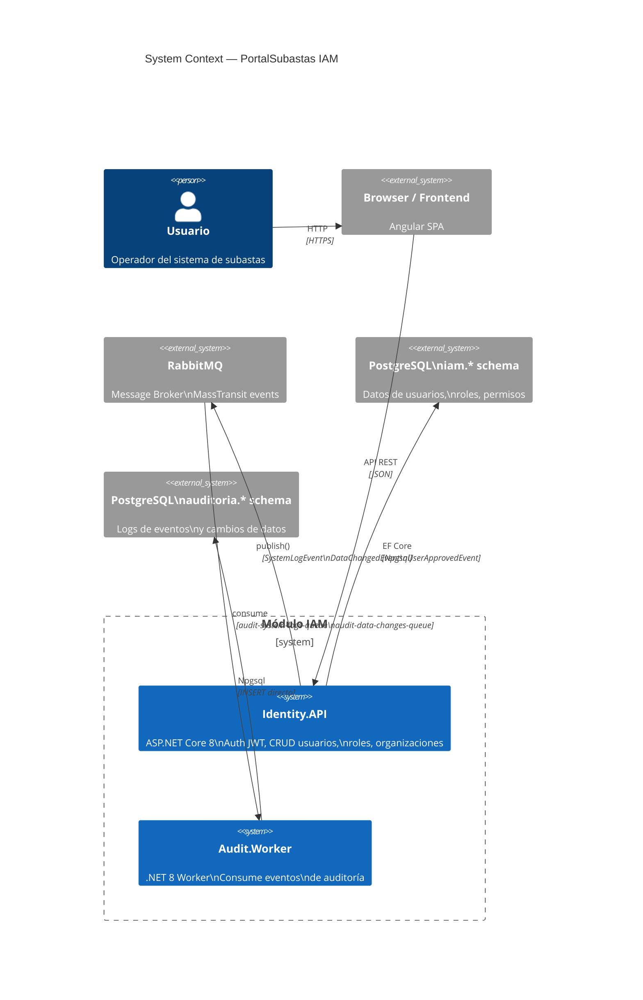
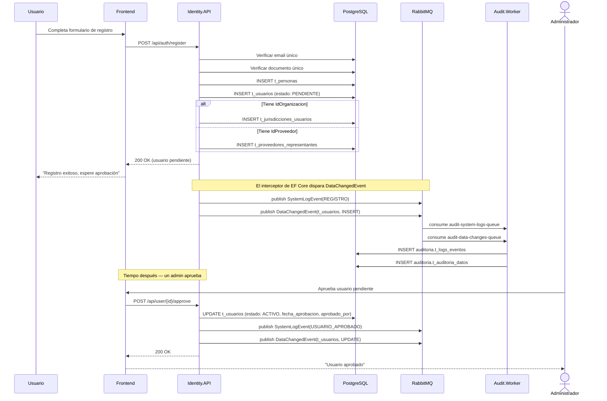
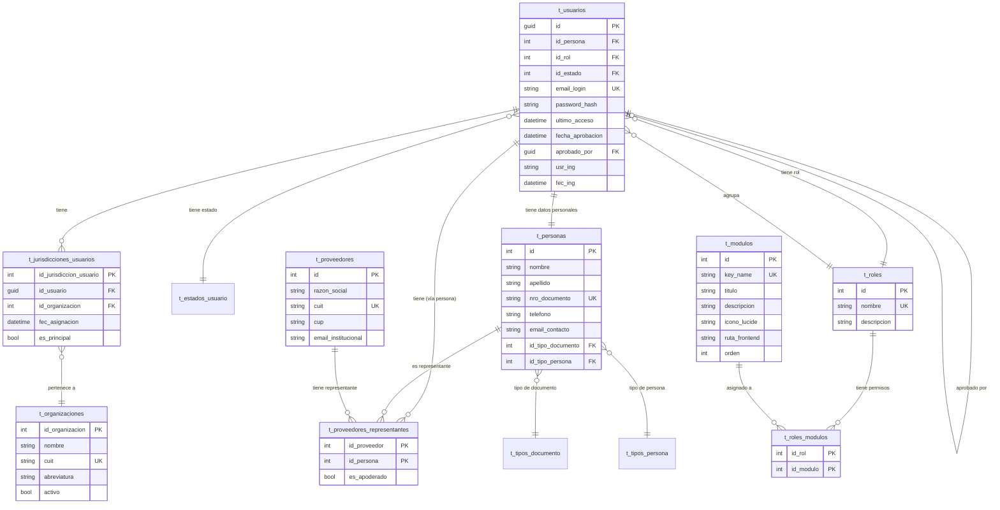
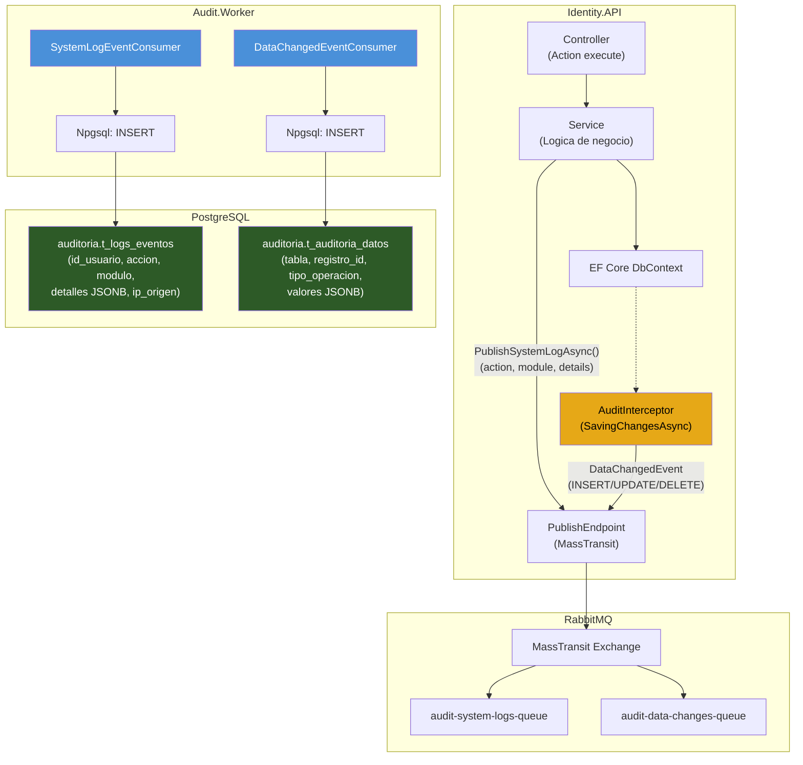
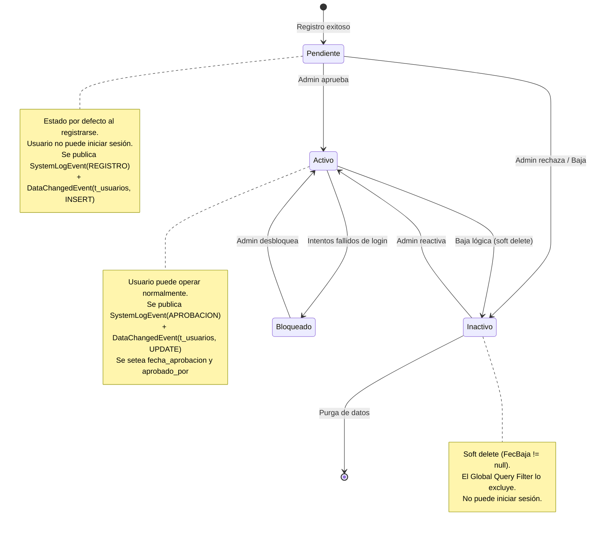
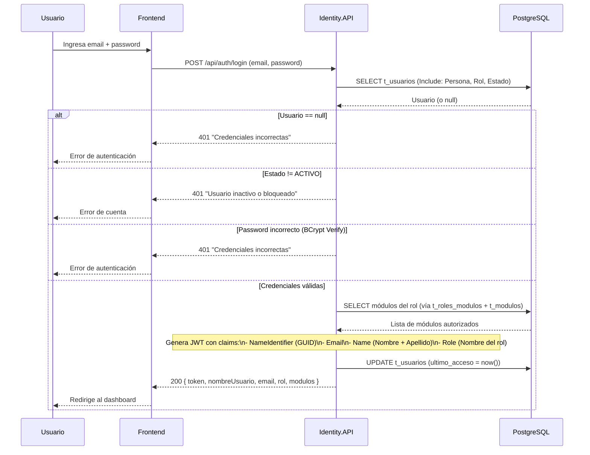

# Módulo IAM — PortalSubastas.Identity

> Spec: `iam-module`
> Versión: 1.0.0
> Tags: `iam`, `identity`, `auth`, `audit`, `rabbitmq`, `mass-transit`

---

## 1. Arquitectura del Módulo IAM

- **Type**: `Architecture`
- **Order**: 1

**Description**: Diagrama de containers del módulo IAM mostrando la Identity API, el Audit Worker, RabbitMQ, y las bases de datos. El usuario interactúa con la Identity API que publica eventos a RabbitMQ; el Audit Worker los consume y persiste en las tablas de auditoría.

---

## 2. Flujo de Registro y Aprobación de Usuario

- **Type**: `Sequence`
- **Order**: 2

**Description**: Secuencia completa desde que un usuario se registra hasta que un administrador lo aprueba. Incluye validaciones, persistencia, publicación de eventos de auditoría y notificación vía RabbitMQ.

---

## 3. Modelo de Datos IAM

- **Type**: `Er`
- **Order**: 3

**Description**: Diagrama entidad-relación del esquema `iam` en PostgreSQL. Muestra las tablas principales, sus relaciones y los campos clave. El modelo soporta usuarios con dos tipos de vinculación: Gestor Licitación (organización) y Proveedor Directo (proveedor).

---

## 4. Pipeline de Auditoría con Eventos

- **Type**: `Flowchart`
- **Order**: 4

**Description**: Flujo completo de auditoría desde que se ejecuta una acción en la API hasta que se persiste en las tablas de auditoría. Muestra cómo el AuditInterceptor de EF Core captura cambios, cómo se publican los eventos, y cómo el Audit.Worker los consume y persiste.

---

## 5. Ciclo de Vida del Usuario

- **Type**: `State`
- **Order**: 5

**Description**: Máquina de estados de un usuario dentro del sistema IAM. Desde el registro como Pendiente, pasando por la aprobación como Activo, hasta posibles estados de Inactivo o Bloqueado. Incluye las acciones que disparan cada transición y los eventos de auditoría asociados.

---

## 6. Flujo de Login y Generación de JWT

- **Type**: `Sequence`
- **Order**: 6

**Description**: Secuencia de autenticación desde que el usuario ingresa sus credenciales hasta que recibe el token JWT con sus módulos y roles. Incluye la verificación de estado, la validación BCrypt, y la carga de módulos autorizados.

---

## Notas Técnicas

- La Identity API usa **GlobalExceptionHandlingMiddleware** — no hay try-catch en los servicios, las excepciones fluyen hacia el middleware que responde con `OperationResponse` estandarizado.
- Los **AutoMapper Profiles** centralizan todo el mapeo: `UserProfile.cs`, `AuthProfile.cs`, `CommonProfile.cs`.
- El **AuditInterceptor** de EF Core captura automáticamente todos los cambios (INSERT, UPDATE, DELETE) y publica `DataChangedEvent` sin necesidad de código manual en cada servicio.
- **Soft Delete**: todas las entidades que implementan `IFullAuditableEntity` tienen query filter global (`FecBaja == null`).
- Las contraseñas se hashean con **BCrypt** (nunca en texto plano).
- El token JWT tiene los claims: `NameIdentifier` (GUID), `Email`, `Name`, `Role`.

### Auditoría (AuditInterceptor + PublishSystemLogAsync)

- **AuditInterceptor**: Interceptor de EF Core que captura automáticamente todos los cambios (INSERT, UPDATE, DELETE) y publica `DataChangedEvent` vía MassTransit sin código manual en cada servicio.
- **PublishSystemLogAsync**: Método en `BaseService` que publica `SystemLogEvent` con el módulo `"IAM"`, la acción, y detalles JSONB.

**Acciones de auditoría registradas (8):**

| Acción | Servicio | Trigger |
|--------|----------|---------|
| `INICIO_SESION` | AuthService | Login exitoso |
| `NUEVO_REGISTRO` | AuthService | Registro de usuario |
| `CAMBIO_PASSWORD` | AuthService | Cambio de contraseña |
| `USUARIO_APROBADO` | UserService | Admin aprueba usuario |
| `RESETEO_PASSWORD` | UserService | Admin resetea contraseña |
| `USUARIO_DESVINCULADO` | UserService | Desvincular entidad (Gestor/Proveedor) |
| `CAMBIO_ROL` | UserService | Cambio de rol de usuario |
| `USUARIO_VINCULADO` | UserService | Vincular entidad (Gestor/Proveedor) |
