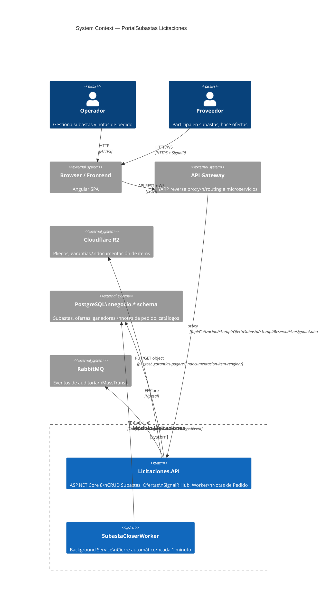
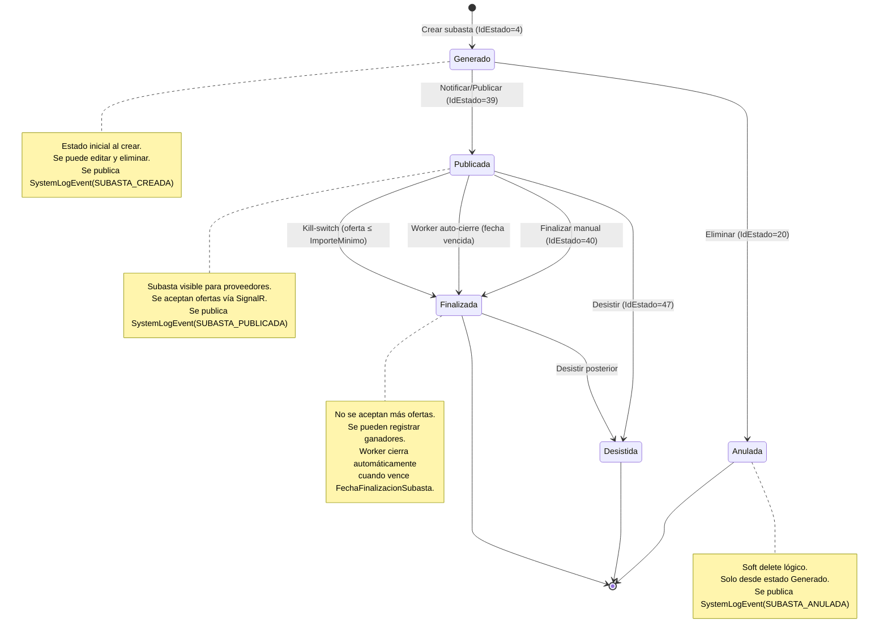
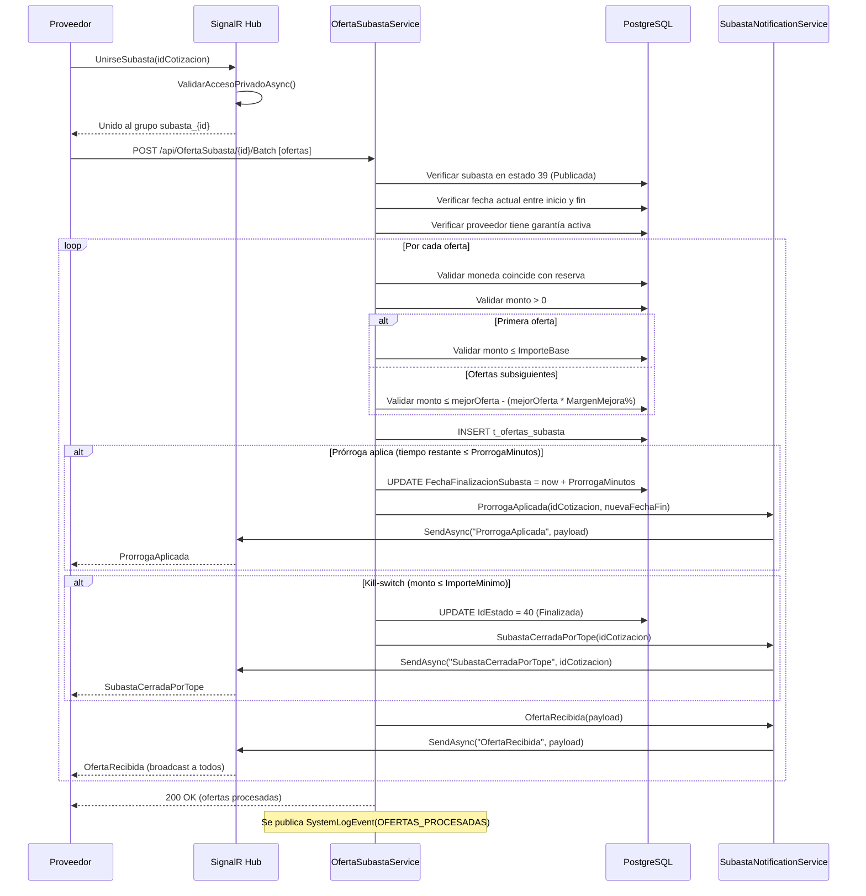
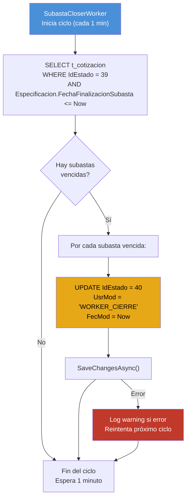
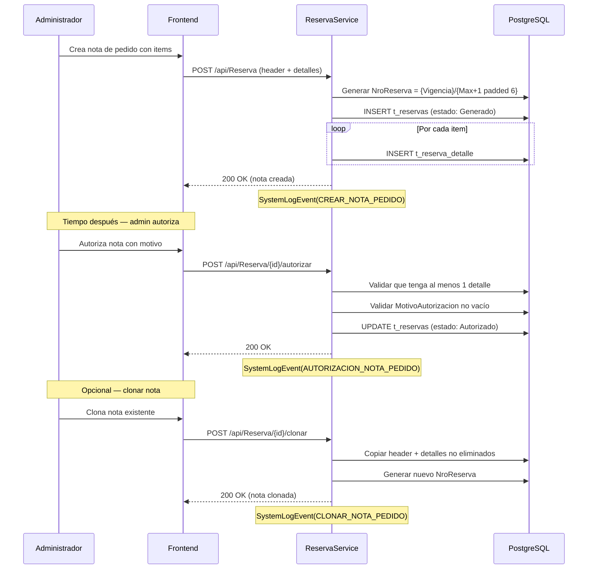
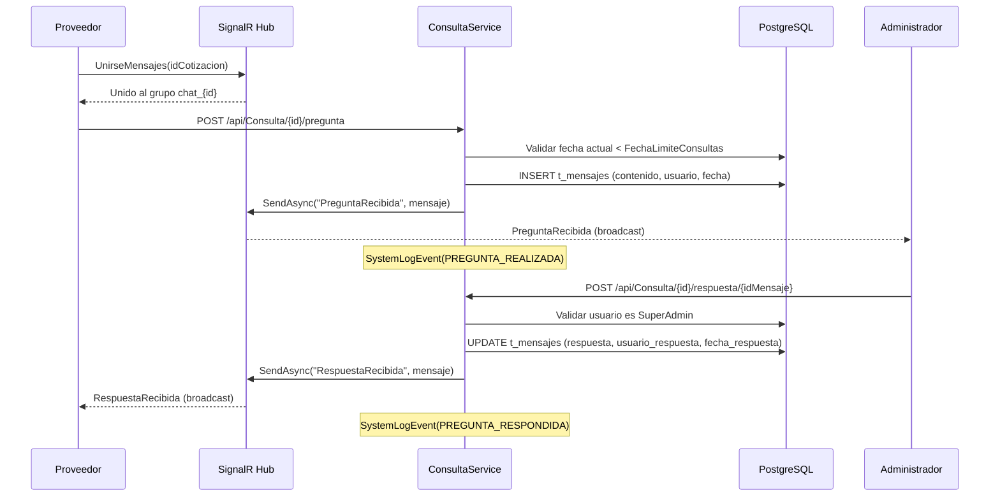

# Módulo Licitaciones — PortalSubastas.Licitaciones

> Spec: `licitaciones-module`
> Versión: 1.0.0
> Tags: `licitaciones`, `subastas`, `ofertas`, `signalr`, `r2`, `notas-pedido`

---

## 1. Arquitectura del Módulo Licitaciones

- **Type**: `Architecture`
- **Order**: 1

**Description**: Diagrama de containers del módulo Licitaciones mostrando la Licitaciones API, su conexión a PostgreSQL (schema `negocio`), integración con Cloudflare R2 para documentos/garantías, SignalR para ofertas y chat en tiempo real, y el SubastaCloserWorker para cierre automático.

---

## 2. Máquina de Estados de Subasta

- **Type**: `State`
- **Order**: 2

**Description**: Ciclo de vida completo de una subasta (Cotización). Desde el estado inicial Generado, pasando por Publicada y En Curso, hasta los estados finales Finalizada, Desistida o Anulada. Incluye las acciones que disparan cada transición y los eventos de auditoría asociados.

---

## 3. Modelo de Datos — Esquema Negocio (Licitaciones)

- **Type**: `Er`
- **Order**: 3

**Description**: Diagrama entidad-relación de las tablas de licitaciones en el esquema `negocio`. Muestra las relaciones entre subastas, especificaciones, detalles, renglones, ofertas, ganadores, consultas, garantías y documentos.

```mermaid
erDiagram
    TCotizacion ||--|| TCotizacionEspecificacion : "tiene 1:1"
    TCotizacion ||--o{ TCotizacionDetalle : "tiene items"
    TCotizacion ||--o{ TCotizacionRenglon : "tiene renglones"
    TCotizacion ||--o{ TCotizacionProveedor : "proveedores inscritos"
    TCotizacion ||--o{ TOfertaSubasta : "tiene ofertas"
    TCotizacion ||--o{ TMensaje : "tiene consultas"
    TCotizacion ||--o{ TGarantiaSubasta : "tiene garantías"
    TCotizacion ||--o{ TCotizacionDocumento : "tiene pliegos"
    TCotizacion ||--o{ TDocumentoItemProveedor : "tiene docs de items"
    TCotizacion }o--|| TUnidadesAdministrativa : "unidad adm."

    TCotizacionDetalle }o--o| TCotizacionRenglon : "pertenece a renglón"
    TCotizacionDetalle }o--|| TReservaDetalle : "vinculado a nota"
    TCotizacionDetalle }o--|| TCatalogosBien : "catálogo de bien"
    TCotizacionDetalle ||--o{ TGanador : "tiene ganadores"
    TCotizacionDetalle ||--o{ TOfertaSubasta : "tiene ofertas"

    TOfertaSubasta }o--o| TCotizacionRenglon : "oferta por renglón"

    TReserva ||--o{ TReservaDetalle : "tiene items"
    TReserva }o--|| TUnidadesAdministrativa : "unidad adm."
    TReserva }o--|| TSubResponsable : "sub-responsable"
    TReserva }o--|| TVigencia : "vigencia/ejercicio"

    TReservaDetalle }o--|| TCatalogosBien : "catálogo"
    TReservaDetalle }o--|| TMonedum : "moneda"
    TReservaDetalle }o--|| TObjetosGasto : "objeto de gasto"

    TCotizacion {
        int id PK
        string nro_cotizacion UK
        int id_estado FK
        int id_tipo_contratacion FK
        int id_vigencia FK
        int id_unidad_administrativa FK
        string redeterminacion "1=Pública, 0=Privada, 2=Cerrada"
        string usr_ing
        datetime fec_ing
        string usr_mod
        datetime fec_mod
        string usr_baja
        datetime fec_baja
    }

    TCotizacionEspecificacion {
        int id PK
        int id_cotizacion FK
        datetime fecha_inicio_subasta
        datetime fecha_finalizacion_subasta
        decimal margen_mejora "porcentaje"
        int prorroga_minutos
        bool permite_prorroga
        decimal importe_minimo "kill-switch"
        datetime fecha_limite_consultas
    }

    TCotizacionDetalle {
        int id PK
        int id_cotizacion FK
        int id_renglon FK "nullable"
        int id_reserva_detalle FK
        int id_item FK "catálogo bien"
        decimal cantidad
        decimal precio_unitario
    }

    TOfertaSubasta {
        int id PK
        int id_cotizacion FK
        int id_cotizacion_detalle FK "nullable"
        int id_cotizacion_renglon FK "nullable"
        int id_proveedor FK
        decimal monto
        datetime fecha_oferta
    }

    TGanador {
        int id PK
        int id_cotizacion_detalle FK
        int id_proveedor FK
        decimal monto_adjudicado
    }

    TMensaje {
        int id PK
        int id_cotizacion FK
        string contenido "pregunta"
        string usuario_pregunta
        datetime fecha_pregunta
        string respuesta "nullable"
        string usuario_respuesta "nullable"
        datetime fecha_respuesta "nullable"
    }

    TGarantiaSubasta {
        int id PK
        int id_cotizacion FK
        int id_proveedor FK
        string url_archivo "R2 URL"
        string tipo_garantia
    }

    TReserva {
        int id PK
        string nro_reserva UK "Ejercicio/Secuencial"
        int id_estado FK
        int id_unidad_administrativa FK
        int id_sub_responsable FK
        int id_vigencia FK
        string motivo_autorizacion
    }

    TReservaDetalle {
        int id PK
        int id_reserva FK
        int id_item FK "catálogo bien"
        int id_moneda FK
        int id_objeto_gasto FK
        decimal cantidad
        decimal importe_unitario
    }
```

---

## 4. Flujo de Ofertas en Tiempo Real (SignalR)

- **Type**: `Sequence`
- **Order**: 4

**Description**: Secuencia completa de una oferta en subasta inversa. El proveedor se conecta vía SignalR, envía una oferta, el sistema valida reglas de negocio (garantía, moneda, margen de mejora), persiste la oferta, notifica a todos los participantes, y aplica prórroga automática si corresponde.

---

## 5. Cierre Automático de Subastas (SubastaCloserWorker)

- **Type**: `Flowchart`
- **Order**: 5

**Description**: Flujo del background service que corre cada 1 minuto y cierra automáticamente las subastas cuya fecha de finalización ya venció. El worker consulta subastas en estado 39 (Publicada) con fecha vencida y las pasa a estado 40 (Finalizada).

**Limitaciones conocidas:**
- El worker NO notifica a los clientes vía SignalR cuando cierra una subasta automáticamente
- Los clientes conectados no reciben evento `SubastaCerradaPorTope` ni `OfertaRecibida`
- Se recomienda agregar notificación SignalR en futuras iteraciones

---

## 6. Flujo de Notas de Pedido (Reservas)

- **Type**: `Sequence`
- **Order**: 6

**Description**: Secuencia de creación y autorización de una nota de pedido. Incluye la generación automática de número (Ejercicio/Secuencial), la vinculación con catálogo de bienes, y el proceso de autorización con motivo obligatorio.

---

## 7. Chat de Consultas (SignalR)

- **Type**: `Sequence`
- **Order**: 7

**Description**: Flujo de preguntas y respuestas entre proveedores y administradores vía SignalR. Los proveedores hacen preguntas antes de la fecha límite de consultas, y los administradores (SuperAdmin) responden. Todo se persiste y se broadcastea en tiempo real.

---

## 8. API Endpoints

### Subastas (Cotizaciones)

| Método | Endpoint | Descripción |
|---|---|---|
| `GET` | `/api/Cotizacion` | Listado con filtros |
| `POST` | `/api/Cotizacion` | Crear subasta |
| `PUT` | `/api/Cotizacion/{id}` | Actualizar subasta |
| `DELETE` | `/api/Cotizacion/{id}` | Anular subasta (solo Generado) |
| `GET` | `/api/Cotizacion/{id}` | Detalle completo |
| `POST` | `/api/Cotizacion/{id}/notificar` | Publicar subasta |
| `POST` | `/api/Cotizacion/{id}/finalizar` | Finalizar subasta |
| `POST` | `/api/Cotizacion/{id}/desistir` | Desistir subasta |
| `POST` | `/api/Cotizacion/{id}/prorrogar` | Prorrogar (minutos) |
| `POST` | `/api/Cotizacion/{id}/desistir-participacion` | Proveedor se desiste |
| `GET` | `/api/Cotizacion/{id}/metricas-ahorro` | Métricas de ahorro |

### Dashboard

| Método | Endpoint | Descripción |
|---|---|---|
| `GET` | `/api/Cotizacion/dashboard/en-curso` | Subastas en curso |
| `GET` | `/api/Cotizacion/dashboard/proximas` | Próximas subastas |
| `GET` | `/api/Cotizacion/dashboard/del-mes` | Subastas del mes |
| `GET` | `/api/Cotizacion/buscar` | Búsqueda avanzada |

### Ofertas

| Método | Endpoint | Descripción |
|---|---|---|
| `GET` | `/api/OfertaSubasta/{idCotizacion}` | Historial de ofertas |
| `POST` | `/api/OfertaSubasta/{idCotizacion}/Batch` | Procesar ofertas (batch) |
| `GET` | `/api/OfertaSubasta/MisOfertas` | Mis ofertas (proveedor) |

### Ganadores

| Método | Endpoint | Descripción |
|---|---|---|
| `GET` | `/api/Ganador/{idCotizacion}` | Ganadores de una subasta |
| `POST` | `/api/Ganador` | Registrar ganador |
| `DELETE` | `/api/Ganador/{id}` | Eliminar ganador |

### Garantías

| Método | Endpoint | Descripción |
|---|---|---|
| `GET` | `/api/Garantia/{idCotizacion}` | Garantías de una subasta |
| `POST` | `/api/Garantia` | Subir garantía/pagaré (R2) |
| `DELETE` | `/api/Garantia/{id}` | Eliminar garantía |

### Consultas (Chat)

| Método | Endpoint | Descripción |
|---|---|---|
| `GET` | `/api/Consulta/{idCotizacion}` | Consultas de una subasta |
| `POST` | `/api/Consulta/{idCotizacion}/pregunta` | Realizar pregunta |
| `POST` | `/api/Consulta/{idCotizacion}/respuesta/{idMensaje}` | Responder pregunta |

### Documentación de Ítems

| Método | Endpoint | Descripción |
|---|---|---|
| `GET` | `/api/DocumentoItem` | Documentos de un ítem/renglón |
| `POST` | `/api/DocumentoItem` | Subir documento (R2) |
| `DELETE` | `/api/DocumentoItem/{id}` | Eliminar documento |
| `POST` | `/api/DocumentoItem/enviar-definitiva` | Enviar documentación definitiva |

### Pliegos/Documentos de Subasta

| Método | Endpoint | Descripción |
|---|---|---|
| `GET` | `/api/CotizacionDocumento/{idCotizacion}` | Documentos de una subasta |
| `POST` | `/api/CotizacionDocumento` | Subir pliego (R2) |
| `DELETE` | `/api/CotizacionDocumento/{id}` | Eliminar pliego |

### Notas de Pedido (Reservas)

| Método | Endpoint | Descripción |
|---|---|---|
| `GET` | `/api/Reserva` | Listado con filtros |
| `POST` | `/api/Reserva` | Crear nota de pedido |
| `PUT` | `/api/Reserva/{id}` | Actualizar nota de pedido |
| `DELETE` | `/api/Reserva/{id}` | Anular nota de pedido |
| `POST` | `/api/Reserva/{id}/autorizar` | Autorizar nota de pedido |
| `POST` | `/api/Reserva/{id}/clonar` | Clonar nota de pedido |

### Ítems de Nota de Pedido

| Método | Endpoint | Descripción |
|---|---|---|
| `GET` | `/api/ReservaDetalle/{idReserva}` | Ítems de una nota |
| `POST` | `/api/ReservaDetalle` | Agregar ítem |
| `PUT` | `/api/ReservaDetalle/{id}` | Modificar ítem |
| `DELETE` | `/api/ReservaDetalle/{id}` | Eliminar ítem |
| `POST` | `/api/ReservaDetalle/{id}/desautorizar` | Desautorizar ítem |

### Catálogos (read-only)

| Método | Endpoint | Descripción |
|---|---|---|
| `GET` | `/api/CatalogoBien` | Catálogo de bienes |
| `GET` | `/api/ObjetoGasto` | Objetos de gasto |
| `GET` | `/api/CategoriaProgramatica` | Categorías programáticas |
| `GET` | `/api/Moneda` | Monedas |
| `GET` | `/api/Estado` | Estados |

### SignalR Hub

| Método | Grupo | Descripción |
|---|---|---|
| `UnirseSubasta(id)` | `subasta_{id}` | Unirse a sala de subasta |
| `SalirSubasta(id)` | `subasta_{id}` | Salir de sala de subasta |
| `UnirseMensajes(id)` | `chat_{id}` | Unirse a sala de chat |
| `SalirMensajes(id)` | `chat_{id}` | Salir de sala de chat |
| `EnviarMensaje(id, contenido)` | `chat_{id}` | Enviar mensaje de chat |
| `Escribiendo(id)` | `chat_{id}` | Indicador de escritura |

**Eventos Server-to-Client:**

| Evento | Grupo | Payload |
|---|---|---|
| `OfertaRecibida` | `subasta_{id}` | `{idCotizacion, idCotizacionDetalle, idRenglon, monto, idProveedor, fecha, usuario}` |
| `ProrrogaAplicada` | `subasta_{id}` | `{idCotizacion, nuevaFechaFin}` |
| `SubastaCerradaPorTope` | `subasta_{id}` | `idCotizacion` |
| `PreguntaRecibida` | `chat_{id}` | `ConsultaResponseDto` |
| `RespuestaRecibida` | `chat_{id}` | `ConsultaResponseDto` |
| `MensajeRecibido` | `chat_{id}` | `{usuario, contenido, fecIng}` |
| `UsuarioEscribiendo` | `chat_{id}` | `usuario` |

---

## Notas Técnicas

- **Paginación genérica**: Todos los listados usan `BaseService.GetPagedDataAsync<TEntity, TDto>` que centraliza `Skip/Take/Count/Map`.
- **Sorting dinámico**: Los endpoints aceptan `sortBy` y `sortDirection` como query params.
- **Sin try-catch en servicios**: El `GlobalExceptionHandlingMiddleware` maneja todas las excepciones y responde con `OperationResponse` estandarizado.
- **Soft Delete**: Todas las entidades implementan `IFullAuditableEntity` con query filter global (`FecBaja == null`).
- **DateTimeKind.Unspecified**: Se usa `DateTime.Now` con `Kind=Unspecified` para evitar errores de timezone con PostgreSQL.
- **GlobalUsings**: Los namespaces comunes están centralizados en `GlobalUsings.cs`.
- **Cloudflare R2**: Se usa AWS S3 SDK (`Amazon.S3`) para almacenar pliegos, garantías y documentación de ítems. Configuración en `appsettings.json` bajo `CloudflareR2`.
- **AutoMapper**: Los mapeos están en `CotizacionProfile.cs`, `GarantiaProfile.cs`, `GanadorProfile.cs`, `ReservaProfile.cs`, `CatalogosProfile.cs`.
- **FluentValidation**: Validadores en `Validators/Reserva/` y `Validators/ReservaDetalle/` con auto-validación vía middleware.
- **Timezone**: El entorno fuerza `America/Argentina/Buenos_Aires` al inicio de la aplicación.
- **SignalR Auth**: El hub soporta `access_token` como query string para autenticación WebSocket.

### Reglas de Negocio — Subasta Inversa (Tipo 7)

1. La subasta debe estar en estado **39** (Publicada)
2. La fecha actual debe estar entre `FechaInicioSubasta` y `FechaFinalizacionSubasta`
3. El proveedor **debe tener garantía activa** (`TGarantiaSubasta` con `FecBaja == null`)
4. El monto de la oferta debe ser **> $0.00**
5. La **moneda debe coincidir** con la moneda oficial de `TReservaDetalle.IdMoneda`
6. **Primera oferta**: No puede exceder el precio base (`ImporteBase`)
7. **Ofertas subsiguientes**: Debe ser ≤ `mejorOfertaActual - (mejorOfertaActual * MargenMejora / 100)`
8. **Kill-switch**: Si la oferta ≤ `ImporteMinimo`, la subasta se cierra inmediatamente (estado → 40)

### Prórroga Automática

- Solo si `PermiteProrroga == true` y `ProrrogaMinutos > 0`
- Se activa cuando el tiempo restante ≤ `ProrrogaMinutos` al momento de una oferta válida
- Extiende `FechaFinalizacionSubasta` a `now + ProrrogaMinutos`

### Visibilidad de Subastas

- **Admin (SuperAdmin)**: ve todas las subastas
- **Proveedor**:
  - Pública (`Redeterminacion == "1"`): siempre visible
  - Privada (`Redeterminacion == "0"`): solo si está invitado (`TCotizacionProveedor`)
  - Cerrada (`Redeterminacion == "2"`): solo si está invitado

### Notas de Pedido

- **Auto-numérico**: `{Ejercicio}/{secuencial 6 dígitos}` por vigencia + organización
- **Autorización**: requiere `MotivoAutorizacion` obligatorio
- **Clonación**: copia header + todos los detalles no eliminados
- **Consumo de stock**: excluye subastas en estados 20 (Anulado) y 47 (Desistida)

### Auditoría (AuditInterceptor + PublishSystemLogAsync)

- **AuditInterceptor**: Interceptor de EF Core que captura automáticamente todos los cambios (INSERT, UPDATE, DELETE) y publica `DataChangedEvent` vía MassTransit.
- **PublishSystemLogAsync**: Método en `BaseService` que publica `SystemLogEvent` con el módulo `"LICITACIONES"`.

**Acciones de auditoría registradas (28+):**

| Acción | Servicio | Trigger |
|--------|----------|---------|
| `SUBASTA_CREADA` | CotizacionService | Crear subasta |
| `SUBASTA_MODIFICADA` | CotizacionService | Actualizar subasta |
| `SUBASTA_ANULADA` | CotizacionService | Eliminar/anular subasta |
| `SUBASTA_PUBLICADA` | CotizacionService | Publicar (Notificar) |
| `SUBASTA_FINALIZADA` | CotizacionService | Finalizar manual |
| `SUBASTA_DESISTIDA` | CotizacionService | Desistir subasta |
| `SUBASTA_PRORROGADA` | CotizacionService | Prorrogar tiempo |
| `PROVEEDOR_DESISTE_SUBASTA` | CotizacionService | Proveedor se retira |
| `OFERTAS_PROCESADAS` | OfertaSubastaService | Ofertas enviadas (batch) |
| `GANADOR_REGISTRADO` | GanadorService | Registrar ganador |
| `GANADOR_ELIMINADO` | GanadorService | Eliminar ganador |
| `GARANTIA_SUBIDA` | GarantiaService | Subir garantía a R2 |
| `GARANTIA_ELIMINADA` | GarantiaService | Eliminar garantía |
| `PREGUNTA_REALIZADA` | ConsultaService | Proveedor hace pregunta |
| `PREGUNTA_RESPONDIDA` | ConsultaService | Admin responde pregunta |
| `DOCUMENTO_ITEM_SUBIDO` | DocumentoItemService | Subir doc de ítem a R2 |
| `DOCUMENTO_ITEM_ELIMINADO` | DocumentoItemService | Eliminar doc de ítem |
| `DOCUMENTACION_DEFINITIVA_ENVIADA` | DocumentoItemService | Envío definitivo |
| `PLIEGO_SUBIDO` | CotizacionDocumentoService | Subir pliego a R2 |
| `PLIEGO_ELIMINADO` | CotizacionDocumentoService | Eliminar pliego |
| `CREAR_NOTA_PEDIDO` | ReservaService | Crear nota de pedido |
| `MODIFICAR_NOTA_PEDIDO` | ReservaService | Actualizar nota |
| `ELIMINAR_NOTA_PEDIDO` | ReservaService | Eliminar nota |
| `AUTORIZACION_NOTA_PEDIDO` | ReservaService | Autorizar nota |
| `CLONAR_NOTA_PEDIDO` | ReservaService | Clonar nota |
| `AGREGAR_ITEM_NOTA` | ReservaDetalleService | Agregar ítem a nota |
| `MODIFICAR_ITEM_NOTA` | ReservaDetalleService | Modificar ítem |
| `ELIMINAR_ITEM_NOTA` | ReservaDetalleService | Eliminar ítem |
| `DESAUTORIZAR_ITEM` | ReservaDetalleService | Desautorizar ítem |

### Riesgos / Issues Conocidos

1. **Worker sin notificación SignalR**: `SubastaCloserWorker` cierra subastas pero no notifica a clientes conectados
2. **Auto-numérico no transaccional**: `NroCotizacion` usa `Max()` sin lock — posible race condition bajo concurrencia
3. **DI duplicado**: `IFileStorageService → CloudflareR2StorageService` registrado dos veces (la segunda gana)
4. **Kill-switch solo tipo 7**: El `ImporteMinimo` solo aplica para `IdTipoContratacion == 7` (Subasta Inversa)
