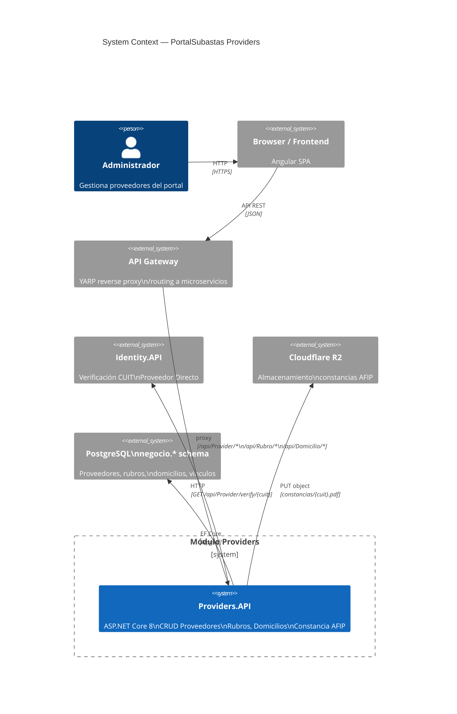
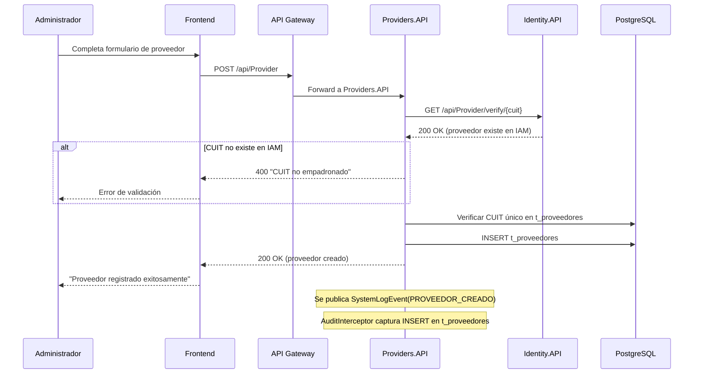
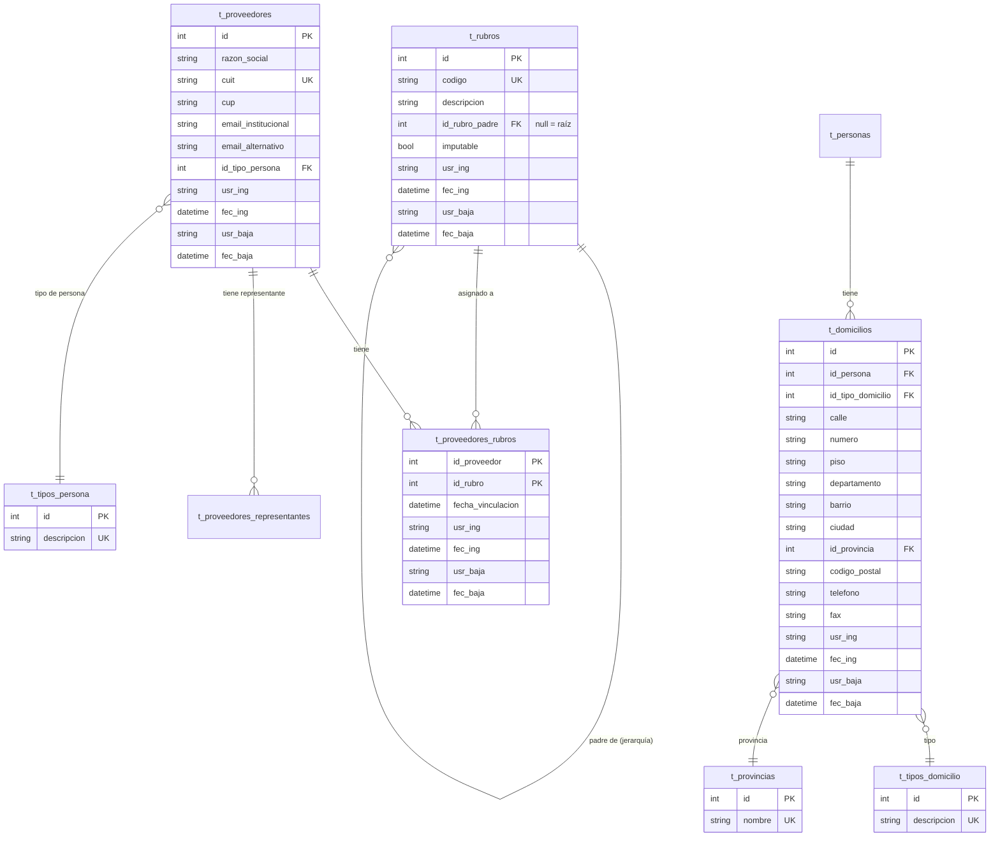
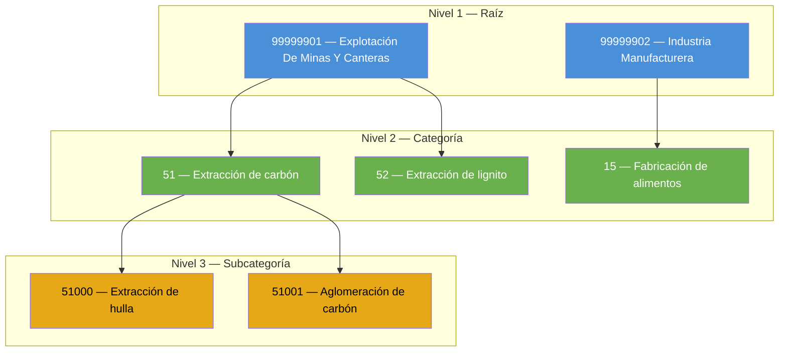
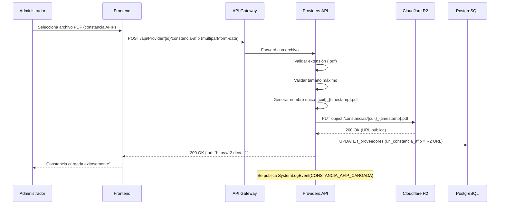
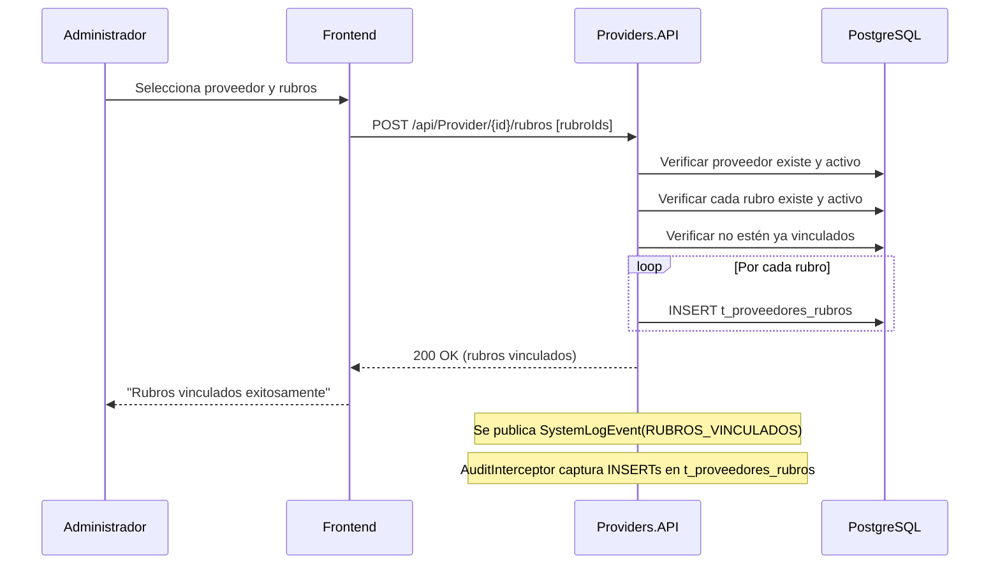

# Módulo Providers — PortalSubastas.Providers

> Spec: `providers-module`
> Versión: 1.0.0
> Tags: `providers`, `negocio`, `rubros`, `domicilios`, `afip`, `r2`

---

## 1. Arquitectura del Módulo Providers

- **Type**: `Architecture`
- **Order**: 1

**Description**: Diagrama de containers del módulo Providers mostrando la Providers API, su conexión a PostgreSQL (schema `negocio`), integración con Cloudflare R2 para constancias AFIP, y la comunicación con el módulo IAM para verificación de CUIT.

---

## 2. Flujo de Creación de Proveedor

- **Type**: `Sequence`
- **Order**: 2

**Description**: Secuencia completa desde que un administrador crea un proveedor hasta que queda registrado con sus datos verificados. Incluye la verificación de CUIT contra IAM, validación de duplicados, y publicación de eventos de auditoría.

---

## 3. Modelo de Datos — Esquema Negocio

- **Type**: `Er`
- **Order**: 3

**Description**: Diagrama entidad-relación del esquema `negocio` en PostgreSQL. Muestra las tablas de proveedores, rubros jerárquicos, domicilios y sus relaciones.

---

## 4. Jerarquía de Rubros

- **Type**: `Flowchart`
- **Order**: 4

**Description**: Estructura jerárquica de rubros con hasta 3 niveles de profundidad. Los rubros raíz no tienen padre (`id_rubro_padre = null`). Cada rubro puede tener hijos y puede ser marcado como "imputable".

**Reglas de negocio:**
- Máximo 3 niveles de profundidad (raíz → categoría → subcategoría)
- Un rubro no puede ser su propio padre
- No se puede eliminar un rubro que tiene hijos activos
- No se puede eliminar un rubro vinculado a proveedores
- El campo `imputable` indica si el rubro genera obligaciones impositivas

---

## 5. Carga de Constancia AFIP a Cloudflare R2

- **Type**: `Sequence`
- **Order**: 5

**Description**: Flujo de subida de constancia de inscripción AFIP para un proveedor. El archivo PDF se sube a Cloudflare R2 y se almacena la URL en el registro del proveedor.

---

## 6. Vinculación de Rubros a Proveedores

- **Type**: `Sequence`
- **Order**: 6

**Description**: Flujo para vincular uno o más rubros a un proveedor existente. Se valida que el proveedor y los rubros existan y estén activos.

---

## 7. API Endpoints

### Proveedores

| Método | Endpoint | Descripción |
|---|---|---|
| `GET` | `/api/Provider` | Listado paginado con sorting y búsqueda |
| `POST` | `/api/Provider` | Crear proveedor |
| `PUT` | `/api/Provider` | Actualizar proveedor |
| `GET` | `/api/Provider/verify/{cuit}` | Verificar CUIT (proxy a IAM) |
| `GET` | `/api/Provider/{id}/rubros` | Rubros vinculados a un proveedor |
| `POST` | `/api/Provider/{id}/rubros` | Vincular rubros a proveedor |
| `DELETE` | `/api/Provider/{id}/rubros/{rubroId}` | Desvincular rubro |
| `POST` | `/api/Provider/{id}/constancia-afip` | Subir constancia AFIP (R2) |
| `GET` | `/api/Provider/{id}/afip/verify/{cuit}` | Verificar CUIT en AFIP (mock) |

### Rubros

| Método | Endpoint | Descripción |
|---|---|---|
| `GET` | `/api/Rubro` | Listado paginado con sorting y búsqueda |
| `POST` | `/api/Rubro` | Crear rubro |
| `PUT` | `/api/Rubro` | Actualizar rubro |
| `DELETE` | `/api/Rubro/{id}` | Eliminar rubro (solo sin hijos ni proveedores) |
| `GET` | `/api/Rubro/tree` | Árbol jerárquico completo (3 niveles) |
| `GET` | `/api/Rubro/{parentId}/children` | Hijos directos de un rubro |
| `GET` | `/api/Rubro/search?q=` | Búsqueda de rubros por código/descripción |

### Domicilios

| Método | Endpoint | Descripción |
|---|---|---|
| `GET` | `/api/Domicilio/persona/{personaId}` | Domicilios de una persona |
| `POST` | `/api/Domicilio/persona/{personaId}` | Crear domicilio |
| `PUT` | `/api/Domicilio` | Actualizar domicilio |
| `DELETE` | `/api/Domicilio/{id}` | Eliminar domicilio |
| `GET` | `/api/Domicilio/tipos-domicilio` | Catálogo tipos de domicilio |
| `GET` | `/api/Domicilio/provincias` | Catálogo de provincias |

---

## Notas Técnicas

- **Paginación genérica**: Todos los listados usan `BaseService.GetPagedDataAsync<TEntity, TDto>` que centraliza `Skip/Take/Count/Map`.
- **Sorting dinámico**: Los endpoints aceptan `sortBy` y `sortDirection` como query params. El backend aplica el ordenamiento con pattern matching en LINQ.
- **Sin try-catch en servicios**: El `GlobalExceptionHandlingMiddleware` maneja todas las excepciones y responde con `OperationResponse` estandarizado.
- **Soft Delete**: Todas las entidades implementan `IFullAuditableEntity` con query filter global (`FecBaja == null`).
- **DateTimeKind.Unspecified**: Se usa `DateTime.Now` con `Kind=Unspecified` para evitar errores de timezone con PostgreSQL `timestamp without time zone`.
- **GlobalUsings**: Los namespaces comunes están centralizados en `GlobalUsings.cs` para limpiar las clases de servicio.
- **Cloudflare R2**: Se usa para almacenar constancias AFIP. La configuración va en `appsettings.json` bajo la sección `R2`.
- **AFIP Service**: Actualmente es un **mock**. La integración real con ARCA requiere certificado digital `.pfx` (ver TODO en `AfipService.cs`).
- **AutoMapper**: Los mapeos están en `RubroProfile.cs`, `ProviderProfile.cs`, `DomicilioProfile.cs`.
- **Árbol de rubros**: El endpoint `/tree` devuelve una estructura recursiva con máximo 3 niveles de profundidad.

### Auditoría (AuditInterceptor + PublishSystemLogAsync)

- **AuditInterceptor**: Interceptor de EF Core que captura automáticamente todos los cambios (INSERT, UPDATE, DELETE) y publica `DataChangedEvent` vía MassTransit sin código manual en cada servicio.
- **PublishSystemLogAsync**: Método en `BaseService` que publica `SystemLogEvent` con el módulo `"PROVIDERS"`, la acción, y detalles JSONB.

**Acciones de auditoría registradas (11):**

| Acción | Servicio | Trigger |
|--------|----------|---------|
| `PROVEEDOR_CREADO` | ProviderService | Crear proveedor |
| `PROVEEDOR_ACTUALIZADO` | ProviderService | Actualizar proveedor |
| `RUBRO_VINCULADO` | ProviderService | Vincular rubro a proveedor |
| `RUBRO_DESVINCULADO` | ProviderService | Desvincular rubro de proveedor |
| `CONSTANCIA_AFIP_SUBIDA` | ProviderService | Subir constancia AFIP a R2 |
| `RUBRO_CREADO` | RubroService | Crear rubro |
| `RUBRO_ACTUALIZADO` | RubroService | Actualizar rubro |
| `RUBRO_ELIMINADO` | RubroService | Eliminar rubro (soft delete) |
| `DOMICILIO_CREADO` | DomicilioService | Crear domicilio |
| `DOMICILIO_ACTUALIZADO` | DomicilioService | Actualizar domicilio |
| `DOMICILIO_ELIMINADO` | DomicilioService | Eliminar domicilio (soft delete) |
